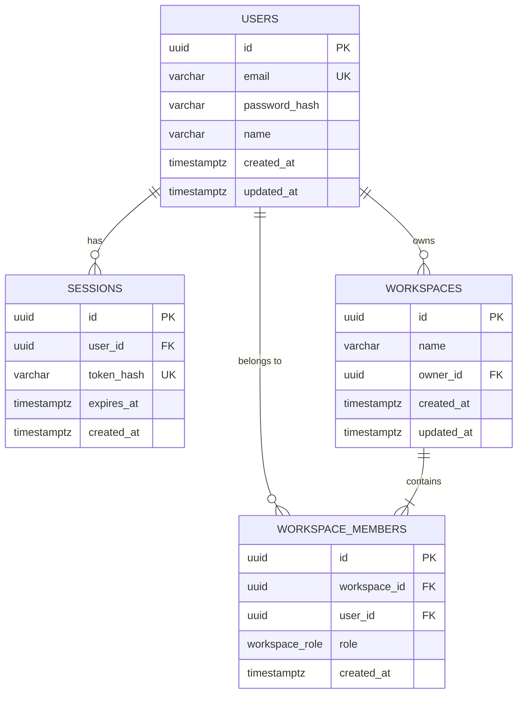

# VidSnapAI — System Architecture

## 1. Monorepo Overview

VidSnapAI is structured as a modern TypeScript-first monorepo managed via `pnpm-workspace`.

```
vidsnapai/
├── apps/
│   ├── api/             # Express.js REST API with session auth and RBAC
│   ├── web/             # Vite + React 19 Frontend with modern CSS design system
│   └── worker/          # BullMQ background worker for queue processing
├── packages/
│   ├── types/           # Shared TypeScript domain contracts and API models
│   ├── validation/      # Shared Zod validation schemas
│   ├── config/          # Typed environment variable loader
│   ├── database/        # Drizzle ORM schema, migrations, connection pool, repositories
│   ├── ai/              # AIProvider interface and GeminiProvider implementation
│   ├── media/           # MediaProvider interface and PexelsProvider implementation
│   ├── video/           # VideoRenderer clean interface specification
│   ├── brand/           # Contract placeholder for Phase 2: Brand Brain
│   ├── campaign/        # Contract placeholder for Phase 3: Marketing Brain
│   ├── content/         # Contract placeholder for Phase 4: 30-Day Content Planner
│   ├── voice/           # Contract placeholder for Phase 6: Media + Voice
│   ├── captions/        # Contract placeholder for Phase 6: Captions
│   ├── animation/       # Contract placeholder for Phase 7: Animation Intelligence
│   ├── audio/           # Contract placeholder for Phase 6: Audio / SFX
│   └── storage/         # StorageProvider contract definition
├── infrastructure/
│   ├── docker/          # Docker Compose for PostgreSQL 16 & Redis 7
│   └── migrations/      # Version-controlled SQL migration scripts
└── docs/
    ├── architecture.md  # System architecture & domain boundaries
    └── development.md   # Developer onboarding and runbook
```

---

## 2. Database Architecture (PostgreSQL + Drizzle ORM)

### Entity Relationship Model



### Multi-Tenant Isolation
All future domain entities (Brands, Campaigns, Content, Reels, Assets) are strictly scoped to a `workspace_id`. Cross-workspace data leakage is prevented via mandatory server-side middleware `requireWorkspaceRole()`.

---

## 3. Authentication & Session Architecture

1. **Password Security**: Passwords are validated using strict complexity rules (minimum 8 chars, uppercase, lowercase, numeric) and hashed using bcrypt (12 salt rounds).
2. **Session Storage**: Secure random 32-byte session tokens are generated on login/signup, SHA-256 hashed, and stored in PostgreSQL with a 30-day expiration.
3. **Cookie Delivery**: Raw session tokens are sent via `Set-Cookie` with `HttpOnly`, `SameSite=Lax`, and `Secure` (in production). Plaintext credentials or session tokens are never stored in `localStorage` or browser storage.
4. **Rate Limiting**: Authentication endpoints are rate-limited per IP to prevent brute-force attacks.

---

## 4. Authorization & RBAC

| Role | Permissions |
|---|---|
| **OWNER** | Full control over workspace, delete workspace, manage members, billing |
| **ADMIN** | Manage members (invite/remove), edit workspace configuration, manage assets |
| **MEMBER** | View workspace assets, initiate workflows, view health and status |

Authorization is enforced on all workspace routes via `requireWorkspaceRole(['OWNER', 'ADMIN'])`.

---

## 5. Provider Abstraction Model

### AI Provider (`packages/ai`)
```typescript
interface AIProvider {
  readonly providerName: string;
  generateText(prompt: string, options?: AIGenerationOptions): Promise<AITextResponse>;
  generateStructured<T>(prompt: string, schema: unknown, options?: AIGenerationOptions): Promise<T>;
}
```
All AI calls throughout VidSnapAI depend exclusively on the `AIProvider` contract. `GeminiProvider` implements this contract using the official `@google/genai` SDK.

### Media Provider (`packages/media`)
```typescript
interface MediaProvider {
  readonly providerName: string;
  searchVideos(params: MediaSearchQuery): Promise<MediaSearchResult>;
  searchImages(params: MediaSearchQuery): Promise<MediaSearchResult>;
  getAssetById(id: string): Promise<MediaAsset | null>;
}
```
`PexelsProvider` implements `MediaProvider` for stock video and image retrieval.

### Video Renderer (`packages/video`)
```typescript
interface VideoRenderer {
  readonly rendererName: string;
  submitRenderJob(spec: RenderTimelineSpec): Promise<{ jobId: string }>;
  getRenderJobStatus(jobId: string): Promise<RenderJobStatus>;
  cancelRenderJob(jobId: string): Promise<boolean>;
}
```

---

## 6. Background Queue & Worker (`BullMQ` + `Redis`)

1. **Queue Producer (`apps/api`)**: Routes push background tasks onto named BullMQ queues (`test-queue`).
2. **Queue Consumer (`apps/worker`)**: Worker processes consume tasks with concurrency controls, exponential backoff retries, and structured logging.

---

## 7. Future Phase Boundaries

- **Phase 2 — Brand Brain**: Brand identity, guidelines, website crawler, visual palette.
- **Phase 3 — Marketing Brain**: Campaign goals, audience targeting, multi-week campaign engine.
- **Phase 4 — 30-Day Content Planner**: Daily calendar planning, copy generation, content pillars.
- **Phase 5 — Autonomous Reel Orchestrator**: Scripting, scene planning, hook generation.
- **Phase 6 — Media + Voice + Captions**: ElevenLabs integration, audio ducking, caption sync.
- **Phase 7 — Animation Intelligence**: Keyframe motions, kinetic typography, transitions.
- **Phase 8 — Video Composition & Rendering**: Remotion / FFmpeg video rendering engine.
- **Phase 9 — Scheduling & Publishing**: Social media publishing API integrations.
- **Phase 10 — Meta Ads Integration**: Meta Marketing API campaign syncing.
- **Phase 11 — Analytics & Optimization**: Performance loopback.
- **Phase 12 — Billing & Teams**: Stripe subscriptions, team seats, credit usage.
